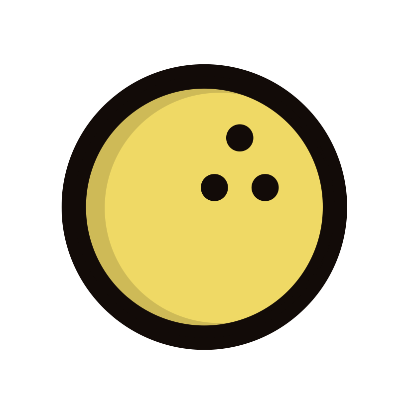

  <h1>Bowling Alley</h1>

    

    
    
    
    

## Preview

Welcome to **Bowling Alley** iOS project repository!

This is an open-source project for a bowling scoreboard calculator. 

The app is still in the middle of development. I would say that more than 50% is now finished.
This app will be released to the App Store when finished. Feel free to take a look around the project now!

It was developed with TDD in mind, so that every user journey and every edge case would be covered. 
Hopefully it will achieve this goal!

##  TODO

*Disclaimer*
Project is not complete. Probably will be 100% finished in October!
This is the list of tasks that are left to do:
- Layout for displaying frames,
- Layout for leaderboard screen,
- Logic for starting and finishing the game,
- Saving finished games to local storage,
- Cool animations.

## Help

If you don't understand the code or there is some other issue that you would like to discuss feel free to drop an e-mail at
`marcelmierzejewski@gmail.com`
